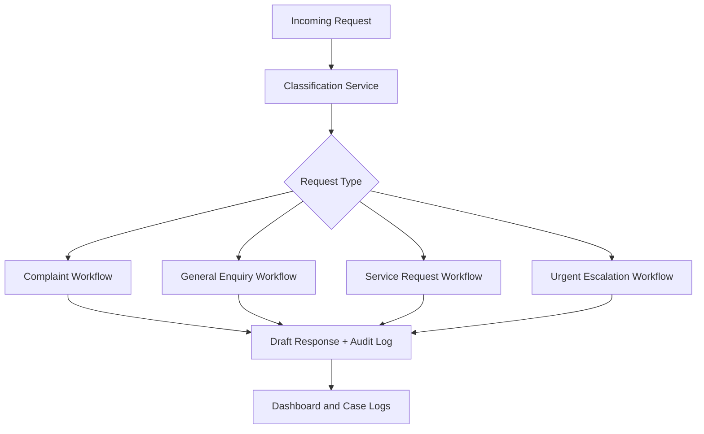

# Architecture

## Goal

The prototype demonstrates how AI can classify incoming operational requests and trigger different remediation workflows for each request type.

## System Flow

## Components

- Streamlit UI: request intake, dashboard, and case logs.
- Classifier service: uses OpenAI when configured, otherwise local fallback rules.
- Workflow engine: maps each request type to downstream actions, status, assigned team, and follow-up timing.
- Response generator: creates a customer-facing draft response based on the branch.
- Repository layer: stores and retrieves cases from SQLite.
- SQLite database: keeps an auditable record of classifications, actions, and outputs.

## Remediation Strategy

- Complaint: acknowledge, escalate, priority log, 2-hour follow-up.
- General Enquiry: classify topic, generate response, prepare reply, mark resolved.
- Service Request: extract details, route team, confirm receipt, set SLA timer.
- Urgent Escalation: human review flag, supervisor notification, urgent acknowledgement, pause auto-resolution.

## Production Enhancements

- Replace simulated routing with ticketing integrations.
- Add real email or shared inbox intake.
- Add human approval before sending generated responses.
- Add evaluation dataset and classification accuracy scoring.
- Add authentication and role-based access for operations users.
